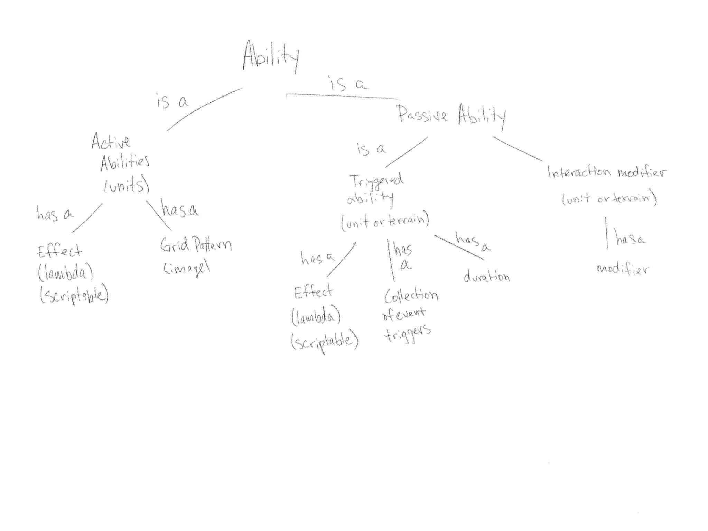
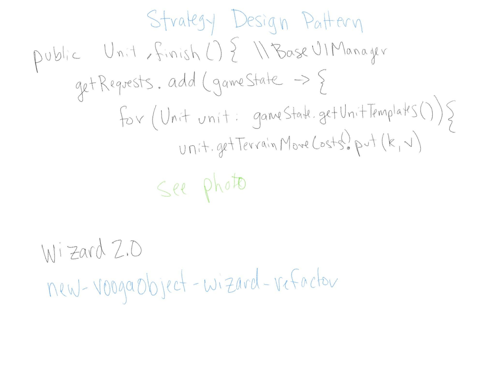
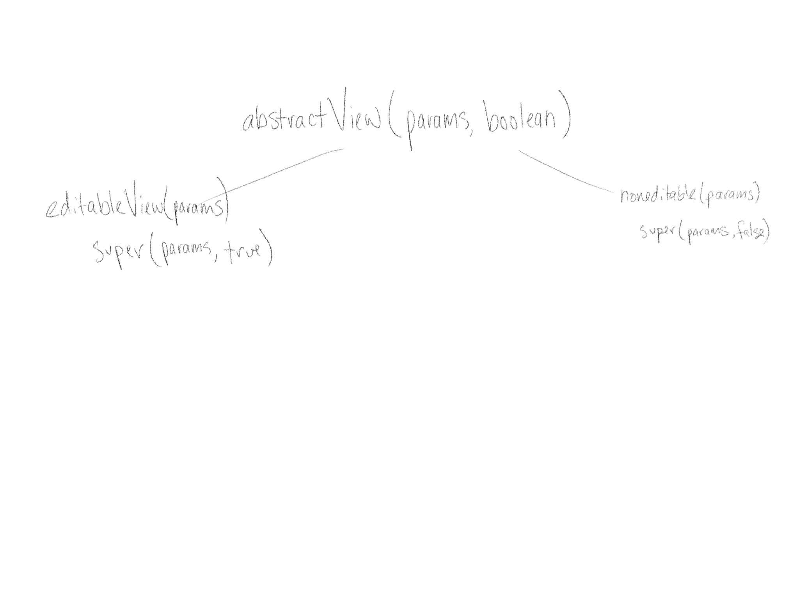
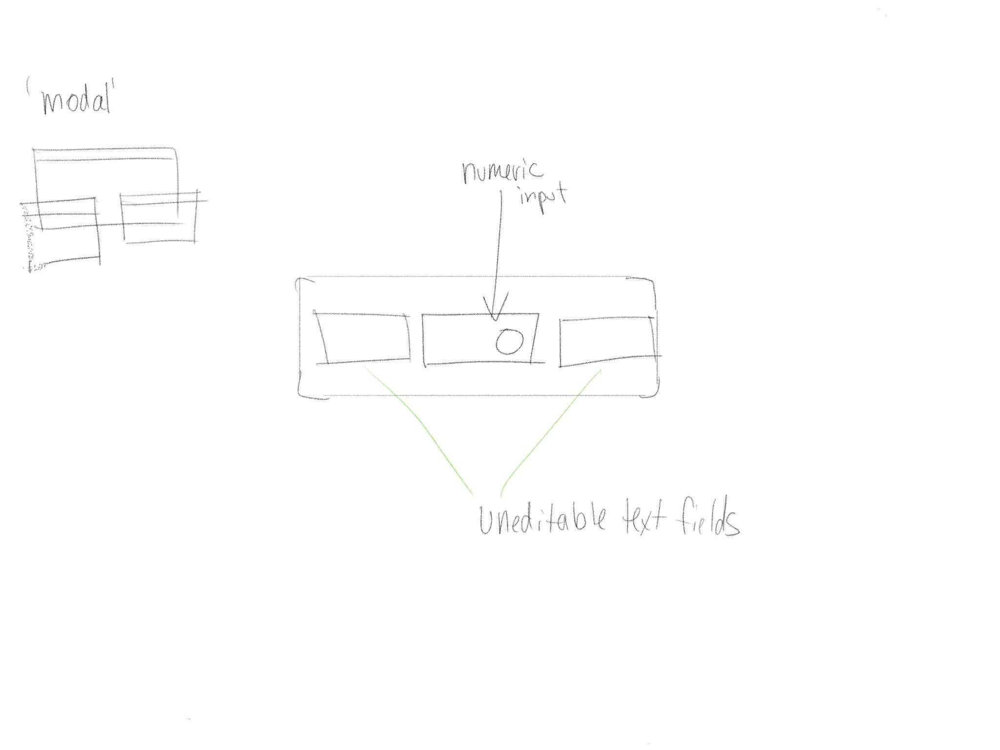
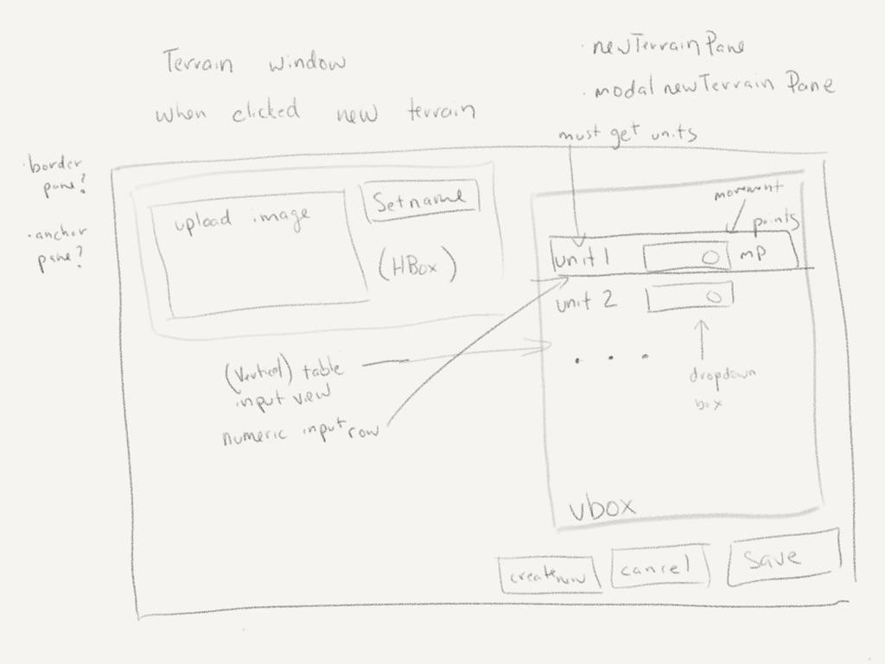
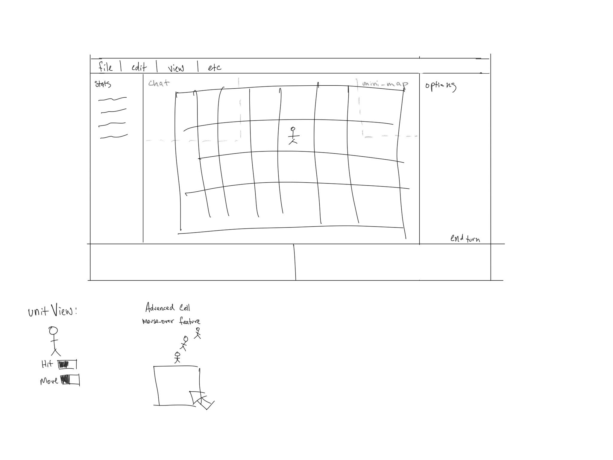
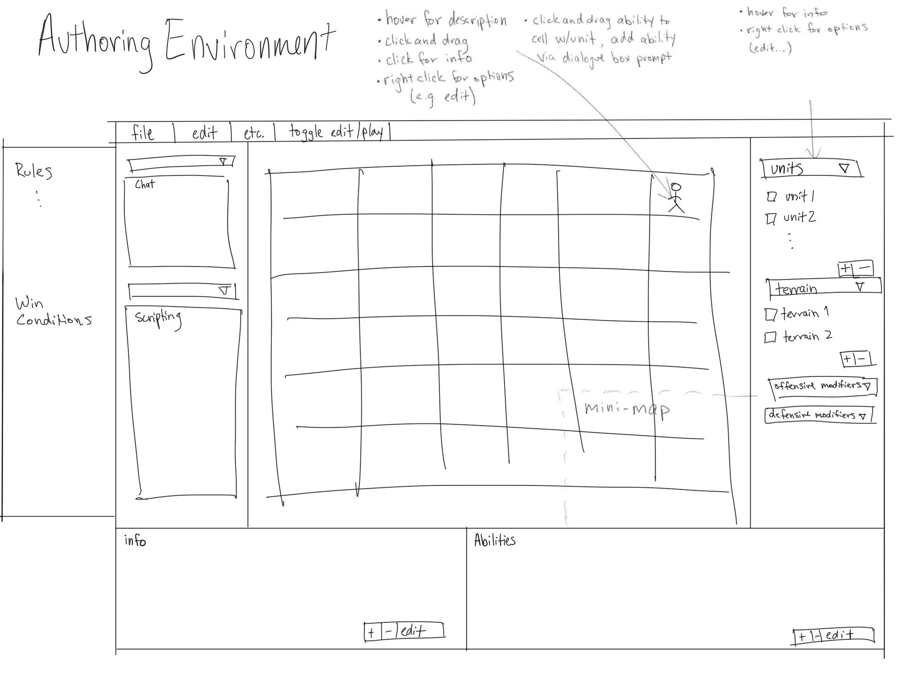

**Design**

**Names:** 

* Dylan Peters (dlp22)

* Kris Elbert (ke60)

* Faith Rodriguez (far10)

* Stone Mathers (smm117)

* Tavo Loaiza (eol) 

* Alexander Zapata (az73) 

* Noah Pritt (ncp14)

* Timmy Huang (th174)

* Sam Schwaller (scs51)

* Andreas Santos (ajs118)

**Introduction**

*This section describes the problem your team is trying to solve by writing this program, the primary design goals of the project (i.e., where is it most flexible), and the primary architecture of the design (i.e., what is closed and what is open). Describe your chosen game genre and what qualities make it unique that your design will need to support. Discuss the design at a high-level (i.e., without referencing specific classes, data structures, or code).*

VOOGASalad is a game engine that provides a game authoring and game playing environment. Our game engine is designed to author turn-based strategy/tactics games, in which each player manipulates a set of units on a grid to achieve an objective. The most direct examples of turn-based strategy tactics games include Battle for Wesnoth, Civilization, Fire Emblem, Final Fantasy Tactics, and Chrono Trigger. Our engine should be flexible enough to support other types turn-based strategy games, such as board games like Tic Tac Toe, Risk, and Chess. Finally, a very flexible game engine and game authoring environment would enable users to create games from other genres, such as RPG, MOBA, and Tower Defense, by interpreting them as extensions of turn-based strategy.

**Overview**

*This section serves as a map of your design for other programmers to gain a general understanding of how and why the program was divided up, and how the individual parts work together to provide the desired functionality. Describe specific modules you intend to create, their purpose with regards to the program's functionality, and how they collaborate with each other, focusing specifically on each one's API. Include a picture of how the modules are related (these pictures can be hand drawn and scanned in, created with a standard drawing program, or screen shots from [**a UML design program**](http://www.uml-lab.com/en/uml-lab/academic/)). Discuss specific classes, methods, and data structures, but not individual lines of code.*

Our design is split primarily into three parts: the Model, View, and Controller.

- Model (Backend): The model is designed to store the data required to represent a game. It can be manipulated by the controller.
	* Cell
  * Game_Engine
  * Game_Rules
  * Grid
  * Player
  * Unit
  * GameState

- View (Frontend): The front end is designed to allow the user to interact with different parts of the model graphically.
	* Wizard- Implements a strategy pattern and utilizes multiple gui pages to allow the user to specify the properties of the objects they're creating. When finished, returns specified object, and whatever class created the wizard can observe the wizard and get the returned object from it.
  * WorldView- GUI of the main view of the Authoring/Gameplay environment that holds the Grid that is the gameplay environment (as well as the minimap)
  * DetailPane- GUI at the bottom of the Authoring/Gameplay environment that shows details about the current unit or terrain selected as well as the active and passive abilities associated.
  * TemplatePane- GUI at the right of the Authoring environment. Contains all units, terrains, abilities, and other items that the user has created, so they can be dragged and dropped onto cells in the grid.
  * ConditionsPane- GUI at the left of the Authoring environment. Contains all rules (turn actions, turn requirements, and end conditions) that the user has created, and allows user to select them.
  

- Controller: Designed to be the middle man between the model and view, in order to help encapsulate them from each other and prevent dependencies.
	* Communication Controller - A controller that also communicates with a server in order to play networked games.

The game data is saved in the form of XML files in order to make them easily readable and editable. Game objects that can be saved to XML include: an entire game state, units, terrains, abilities (active and passive), grid bound handlers, grid patterns, game boards, and rules such as turn actions, turn requirements, and end conditions. Further game data is saved as binary data files such as images, audio files, and videos.

The game loader is responsible for reading all of the game data files and interpreting them into the proper Java format so that they can be played with the game engine. The game loader is capable of both loading games into the game engine and of saving data from the game editor.

The game engine is responsible for running the game itself. It contains much of the game logic, and interacts with the user through the Game Player, which is a simple set of classes that allow the user to start, stop, quit, and restart the game engine. Our game engine consists of a grid of cells, which should be populated with hexagonal or rectangular cells. The game engine also contains global properties, such as time of day, score, and lives. Each cell has information on its location, terrain, current occupying unit, and any special properties. The cell can query the grid to determine its neighboring cells. Each unit has status such as HP, attacks, defenses, and movement. Moving consumes a unit’s movement points, based on the type of terrain they pass over. A unit’s defense is also modified by the type of terrain its occupying. On each player’s turn, players should be able to manipulate each of their own owned units, as well as create new ones when necessary. Players may be limited in what they can see by Fog of War, which can be implemented within the cells by allowing the cells to determine which players can view them.

A game authoring environment allows users to design games by designing the terrain layout in each cell, as well as create unique units with special properties that interact with terrain, time of day, the grid, and other units. The game authoring environment is designed to be an easy-to-use graphical interface that constructs both the Model and the View for the game. For example, when creating a Tic Tac Toe game, the game editor would be responsible for creating a model with the correct gameplay rules (you cannot move Xs or Os; three in a row wins; etc.), and the game editor would also need to write the rules for the View that determine what image files are used to represent the background, the X sprites, the O sprites, etc.

Our game authoring environment is very similar to the game play environment; the two screens are simply different versions of the same views. The user can toggle between each screen (unless it is in a strictly playing mode, in which case the view will not allow the user to toggle).

**User Interface**

*This section describes how the user will interact with your program (keep it simple to start). Describe the overall appearance of program's user interface components and how users interact with these components (especially those specific to your program, i.e., means of input other than menus or toolbars). Include one or more pictures of the user interface (these pictures can be hand drawn and scanned in, created with a standard drawing program, or screen shots from a dummy program that serves as a exemplar). Describe how a game is represented to the designer and what support is provided to make it easy to create a game. Finally, describe any erroneous situations that are reported to the user (i.e., bad input data, empty data, etc.).*

From the Selection screen, the user can choose to Load a Game, Create a New Game, or Join an Existing Game. When creating a new game, the user will be asked for a port number for the server, and will then be directed to the new Game wizard to choose the basic specs of their game before entering the authoring environment. If loading a game, the user may then select a file and enter either the Play or Development Environments. For joining an existing game, the user will be prompted for an ip address and port number, and will then enter directly into the specified game (either in authoring or play mode).

Both Environments have a menu bar at the top that can take them back to the Selection screen. Scrolling the mouse wheel zooms in and out within zoom extents and holding down the wheel and dragging pans the view. Additionally, there is a small map in the corner that shows the entire extents of the board. Clicking on this will center the user’s view over the center of the grid, or the origin, at a set distance, so the user does not get lost.

When creating a new game, the user must set a name for their game, the author, cell shape (base shapes are hexagonal, and rectangular), and two dimensions for the grid size. A button at the bottom of this selection pop-up will lead the user into the dev environment. All of these selection fields, including name and description, have defaults that the user can change if desired.

In the Dev Environment, panes on the left, right, and bottom, as well as a menubar at the top will provide ways for users to create features (e.g. like units or terrains) and add them to their game, set new end conditions either based on scripts or pre-written default end scripts, and manage game other relevant game information like teams, languages, or authoring/play mode.

On the right hand side, there is a template pane. The user can drop down options for adding Terrain, or properties to cells, and Units, or manipulatable objects that can occupy already-created cells. The user can use default cells that can have limited abilities, such as only storing one unit at a time and having a background color or image to being able to store units only of a certain type and impacting their abilities while in that cell. The user can create entirely new terrains and units or create from previous ones. These custom settings can be used again and again in the game and are saved as new types when the game is saved. 

In the Play Environment, the user gets their grid display which may differ from that of their opponent. Right clicking on a unit will display information about its movement or attack abilities if applicable. A button at the bottom of the screen shows whose turn it is. If a player can move multiple units in one turn, a counter will display the remaining number of moves they can make.
The play environment is actually the same pane as authoring environment, except that switching to play mode will disable all editing capabilities as well as check for end/turn conditions whenever the game state is changed.

**Design Details**

*This section describes each module introduced in the ***_Overview_*** in detail (as well as any other sub-modules that may be needed but are not significant to include in a high-level description of the program). Describe how each module handles specific features given in the assignment specification, what resources it might use, how it collaborates with other modules, and how each could be extended to include additional requirements (from the assignment specification or discussed by your team). Note, each sub-team should have its own API for others in the overall team or for new team members to write extensions. Finally, justify the decision to create each module with respect to the design's key goals, principles, and abstractions.*

Front End:

The front end uses the same classes in both authoring and gameplay mode. However, in game play mode, the front end does not display the templatepane and conditionspane. This is done in order to prevent the user from clicking and dragging an arbitrary number of new units ont the board during gameplay. Furthermore, the grid actually behaves in the same way in both authoring and gameplay: when a unit is clicked, it highlights all the cells it can move to; the only difference is that in authoring mode, if a player selects a unit that is not on his/her team, or if a player selects a unit when it is not his/her turn, the unit does not show any available moves. The grid moves units and attacks units by sending requrests to the backend, and then updating based on the response from the back end. The grid updates by telling each individual cell to update. The individual cell queries the controller for the units that occupy its backend counterpart, and then it creates unitviews to correspond.

Back End:

The back end is split into two parts: the gamestate and the game engine. The game state is a data structure that is designed to store all of the information required to save, load, edit, and play a game. It contains things such as the grid (collection of cells), the teams that are currently involved in the game, the units for each team, the locations of those units, team stats, terrains, abilities, and rules. Essentially, every object that can be created and manipulated on the front end has a back end counterpart that can be saved to an xml file. The game engine is the active portion of the back end. The Game Engine processes effects of actions taken by users during their turn. It checks to make sure the turn actions and turn requirements are applied, checks for end conditions after each move, and ensures that all of the active and passive abilities are used correctly.

Controller:

The controller is the set of classes that act to mediate between the front and back ends. The controller helps insulate the model and view from each other, so that if the model changes, the view does not have to rewrite its code. The second function of the controller is to communicate with the network if the user is playing on a networked game. In a networked game, the controller forwards any communications between the front and back ends to the connected server, which forwards those communications to the rest of the computers, so that every computer is updated when a player makes a move.

**Part II: API**

Our API has been written as Java interfaces found in the git repository. It can be found [here](https://coursework.cs.duke.edu/CompSci308_2017Spring/voogasalad_noplacelikehome).

**Example games**

*Describe three example games from your genre in detail that differ significantly. Clearly identify how the functional differences in these games is supported by your design and enabled by your authoring environment. Use these examples to help make concrete the abstractions in your design.*

1. Civilization is a complex turn based strategy game. Our platform supports this game because we have the ability to create complex units with different types of attacks. Furthermore, through passive abilities on terrains, we can simulate different units having more or less power when on different types of terrain. The units also have the ability to collect things like gold and energy, which is critical to upgrading things in a game like Civilization.

2. Checkers differs from other games in that the player cannot drop new pieces onto the board, but instead must move around the pieces that are already on the board at the beginning of the game. To support this, our game engine supports selection of game pieces by clicking on them, as well as selection of empty cells by clicking. The game engine is able to detect when a player’s turn is over, and then allows the other player to move.

3. In a game like Tic Tac Toe, there is only one terrain for all of the cells, which can hold up to one unit. There are two types of units: Xs and Os, but each player can only place one type. The Game Engine checks for win conditions by asking the cells if they are full and what they are full of. The Game Engine will also checks for Cats condition, when the board is full but there is no winner. Players alternate turns and place one unit each time.

**Design Considerations **

*This section describes any issues which need to be addressed or resolved before attempting to devise a complete design solution. Include any design decisions that each sub-team discussed at length (include pros and cons from all sides of the discussion) as well as any ambiguities, assumptions, or dependencies regarding the program that impact the overall design.*

One of the most difficult design design problems we are facing is how to allow the user to define the win conditions. For example, the winning conditions for Tic Tac Toe are significantly different than the winning conditions for Civilization. Furthermore, even the winning conditions for different variations of a simple game such as Tic Tac Toe can be very complicated (getting four in a row, creating an ‘L’ shape, four next to each other, etc.), and can be hard to create a graphical way of allowing the user to define such a win condition. Our solution for this problem is to allow the user to code the winning conditions using a limited-functionality IDE. The winning conditions that the user codes take the form of Predicates that are checked during each turn to see if a player has won. This strategy of allowing the coding of small parts of the game is used in many current production game development environments. The difficult part of creating this functionality is ensuring that the user can access information about the state of the game, without letting the user’s code break the game, game engine, or game development environment.

Another design consideration we had was how to encapsulate the front and back end from the network. We wanted our game to have the capability of being run over a network, without the front and back end having to be written differently to support it. In order to acheive this, we took the controller and added communication functionality to it. This way, when the front and back end communicate through the controller, the controller simply forwards the commands to a server that echoes the commands to any other clients on the network.

